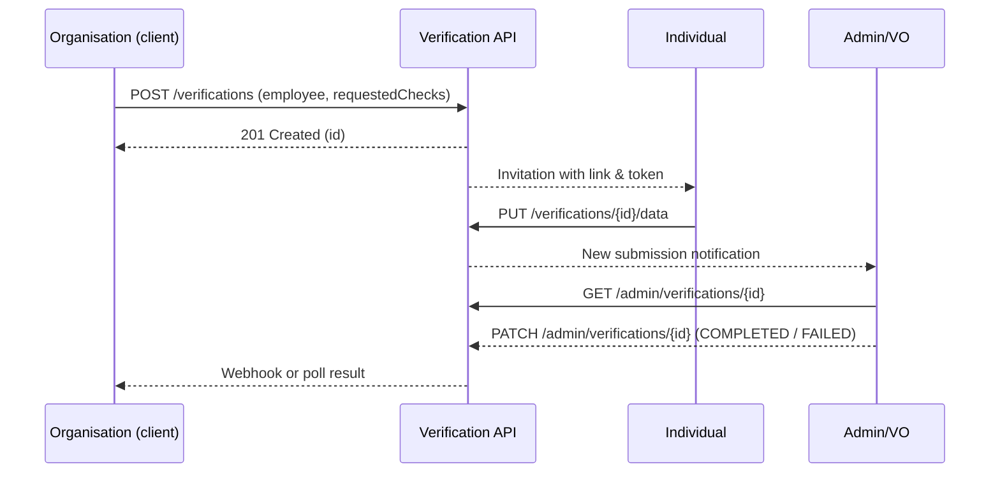
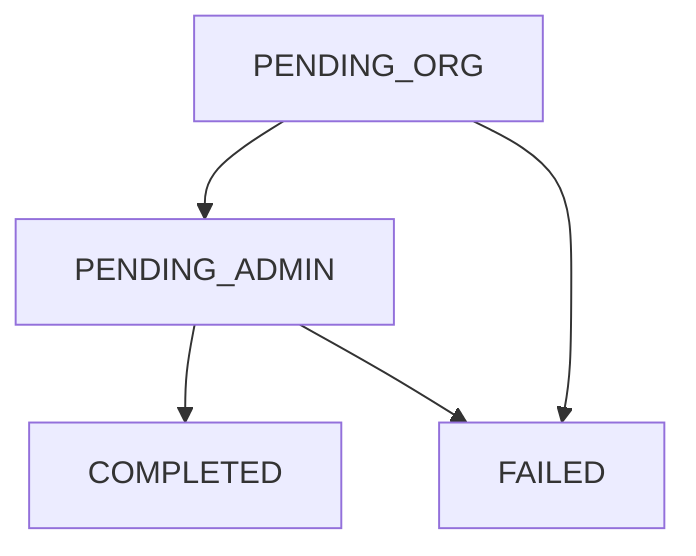

# RegTech Verification Demo – Business Logic Overview

> **Purpose**  
> This demo shows an end‑to‑end compliance workflow in which an **Organisation** requests background checks for an **Individual**, who then submits the required data, and an **Admin** (Verification Officer) reviews and finalises the result.  The FastAPI back‑end, Python SDK, and OAuth 2.0 auth flow are all exercised.

---

## Table of Contents
1. [Actors & Permissions](#actors--permissions)
2. [Authentication & Authorisation](#authentication--authorisation)
3. [End‑to‑End Workflow](#end-to-end-workflow)
4. [API Surface](#api-surface)
5. [State Diagram](#state-diagram)
6. [Running the Demo Locally](#running-the-demo-locally)
7. [Assumptions & Limitations](#assumptions--limitations)

---

## Actors & Permissions

| Role / Entity | Typical User | Permissions |
|---------------|--------------|-------------|
| **Organisation** | HRIS / ATS integration, corporate client | • Create **Verification Requests**  <br>• Poll status <br>• Receive webhook notifications |
| **Individual** | Employee / Contractor | • View required checks  <br>• Submit personal data & documents |
| **Admin** | Verification Officer (VO) | • View all requests & data <br>• Mark result **Completed** / **Failed** <br>• Download audit trail |

Each role authenticates with its own `client_id` / `client_secret` pair issued via the *Admin Portal*.

---

## Authentication & Authorisation

* **Protocol:** OAuth 2.0 (Client‑Credentials)  
* **Token endpoint:** `POST /oauth2/token`  
* **Scopes:**
  * `org.verify` – create & view own requests
  * `user.submit` – view & submit assigned checks
  * `admin.review` – full read/write

> Tokens are JWTs signed by the API; the SDK refreshes them automatically.

### Example – Organisation obtains a token
```bash
curl -X POST https://api.demo.local/oauth2/token \
     -d 'grant_type=client_credentials&client_id=ORG_123&client_secret=•••&scope=org.verify'
```

---

## End‑to‑End Workflow

1. **Organisation ➜ API**  
   `POST /verifications` with employee identifiers + list of checks.  
   *Status → `PENDING_ORG`*
2. **System ➜ Individual**  
   Email/SMS invites the individual to log in to the *Applicant Portal* (out‑of‑scope for this demo – assumed).
3. **Individual ➜ API**  
   `PUT /verifications/{id}/data` sends required PII and documents.  
   *Status → `PENDING_ADMIN`*
4. **Admin ➜ API (Back‑office UI)**  
   `GET /admin/verifications/{id}` shows all submitted data.  
   Admin reviews external evidence (AHPRA, Bankruptcy, WWC, etc.).
5. **Admin ➜ API**  
   `PATCH /admin/verifications/{id}` with `{ "status": "COMPLETED", "outcome": "PASS" }` **or** `{ "status": "FAILED", "reason": "Expired registration" }`.
6. **API ➜ Organisation**  
   Webhook `POST https://client.example.com/webhooks` with final result *‑or‑* Organisation polls `GET /verifications/{id}`.  
   *Workflow ends.*

### Sequence Diagram


---

## API Surface

> *Only business‑logic‑relevant paths are shown; auth, health, and pagination parameters omitted for brevity.*

| Method | Path | Auth Scope | Purpose |
|--------|------|-----------|---------|
| `POST` | `/verifications` | `org.verify` | Create a new verification request |
| `GET` | `/verifications/{id}` | `org.verify` | Get consolidated status/outcome |
| `PUT` | `/verifications/{id}/data` | `user.submit` | Individual submits required data |
| `PATCH` | `/admin/verifications/{id}` | `admin.review` | Admin marks result Completed/Failed |
| `GET` | `/admin/verifications?status=…` | `admin.review` | List & filter all requests |
| `POST` | `/webhooks/verify/{id}` | — | (System → Organisation) push result |

### Status Field Life‑Cycle

```text
PENDING_ORG  →  PENDING_ADMIN  →  COMPLETED | FAILED
    ^                              |
    |                              ↓
    +----------- FAILED ------------
```

---

## State Diagram


---

## Running the Demo Locally

```bash
# 1. Clone & start the FastAPI server
$ git clone https://github.com/your-org/regtech-demo.git
$ cd regtech-demo
$ poetry install
$ uvicorn app.main:app --reload

# 2. (Optional) seed demo data
$ python scripts/seed_demo_clients.py

# 3. Try the flow
$ http POST :8000/oauth2/token client_id==ORG_123 client_secret==secret grant_type==client_credentials scope==org.verify
$ http POST :8000/verifications Authorization:"Bearer <token>" < sample_create.json
```

*Swagger UI available at `http://localhost:8000/docs` when running in dev mode.*

---

## Assumptions & Limitations

* External check integrations are stubbed → response is **mock PASS** after 3 s.  
* No email front‑end – invitation link is logged to console.  
* Data persists in SQLite (`/tmp/demo.db`) and is wiped on restart.  
* RBAC is simplified: scopes map 1‑to‑1 with actor roles.  In production, you may need finer‑grained claim sets.

---

### Next Steps
1. Add asynchronous queue (Celery, SQS) for long‑running checks.  
2. Encrypt PII columns at rest with AWS KMS.  
3. Capture per‑field audit events for regulator export.
